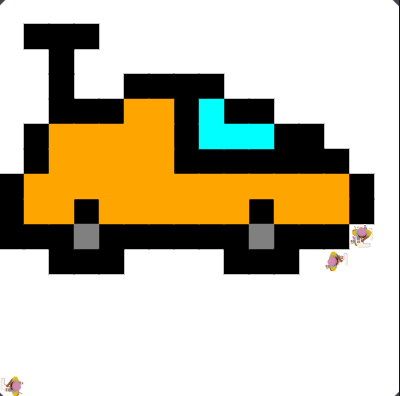

# asphalt-art-project
draws a car. Made in javaLab
# Unit 1 - Asphalt Art

## Introduction

Cities use asphalt art to improve public safety, inspire their residents and visitors, and brighten communities. Your goal is to create asphalt art to revitalize The Neighborhood and bring the community together with the help of the Painter.

## Requirements

Use your knowledge of object-oriented programming, algorithms, the problem solving process, and decomposition strategies to create asphalt art:
- **Create a new subclass** – Create at least one new subclass of the PainterPlus class that is used for a component of the asphalt art design.
- **Plan an algorithm** – Use the problem solving process and decomposition strategies to plan an algorithm that incorporates a combination of sequencing, selection, and/or iteration.
- **Write a method** – Write at least one method in a PainterPlus subclass that contributes to a component of the asphalt art design.
- **Document your code** – Use comments to explain the purpose of the methods and code segments.

## Notes: Neighborhood & Painter Class

This project was created on Code.org's JavaLab platform using the built-in Neighborhood GUI output. To test and edit this project you must build in Code.org's JavaLab with the Neighborhood GUI enabled. For reference to the Painter class documentation, [you can read more here.](https://studio.code.org/docs/ide/javalab/classes/Painter)

## Output:

## Reflection

1. Describe your project.
    - I created a car in javaLab using basic methods and classes. The car was made using a painter object.

2. What are two things about your project that you are proud of?
    - I am proud of the way I wrote my methods as I feel they really helped make this project easy. The main method was the one including the for loop as it allowed me to not have to repeat move and paint.

3. Describe something you would improve or do differently if you had an opportunity to change something about your project.
    - Something I would improve about my project is probably the way my code is written. It is not very organized and the only thing holding it together is my code and comments.

4. How is this project related to STEAM (Science, Technology, Engineering, Art, and Mathematics)? Provide explicit examples from the project and details as possible. 
    - This project is related to STEAM as it incorpates technology, enginnering, art, and a little bit of math. The main element this project is related to is engineeing as you had to code multiple painters in order to create an image. Technology is related since this project was made using code.org on a computer. Art is related as the entire project was a fun way to draw something while still implenting coding. Mathematics was somewhat included as you had to count the squares and how many times you needed to move.

5. What SLOs did you demonstrate during completing this project?
    - The two SLOs I demonstrated in this project is being an critical thinker and being a self-directed goal-oriented individual.
